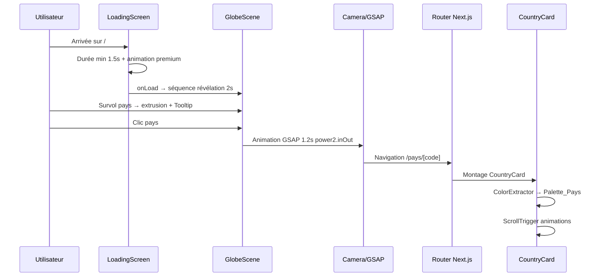
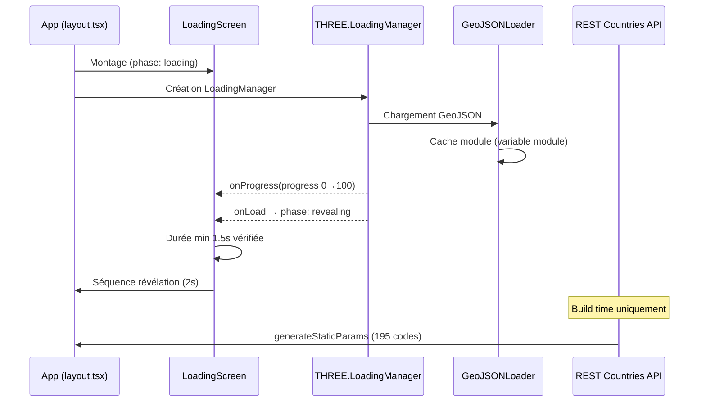
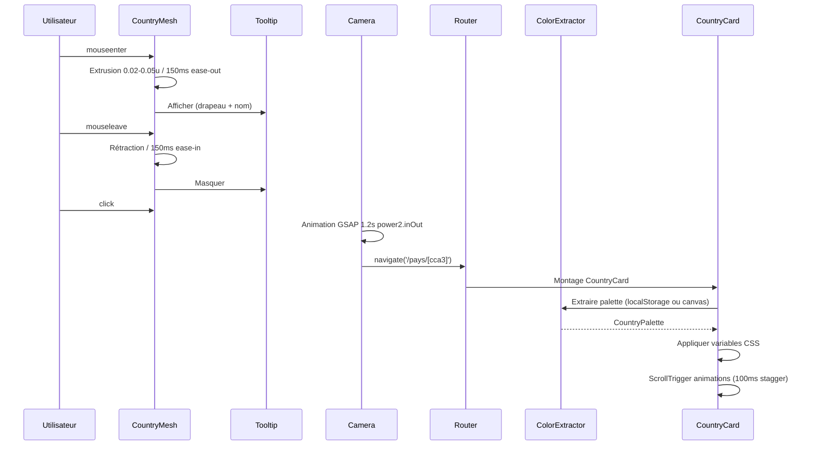
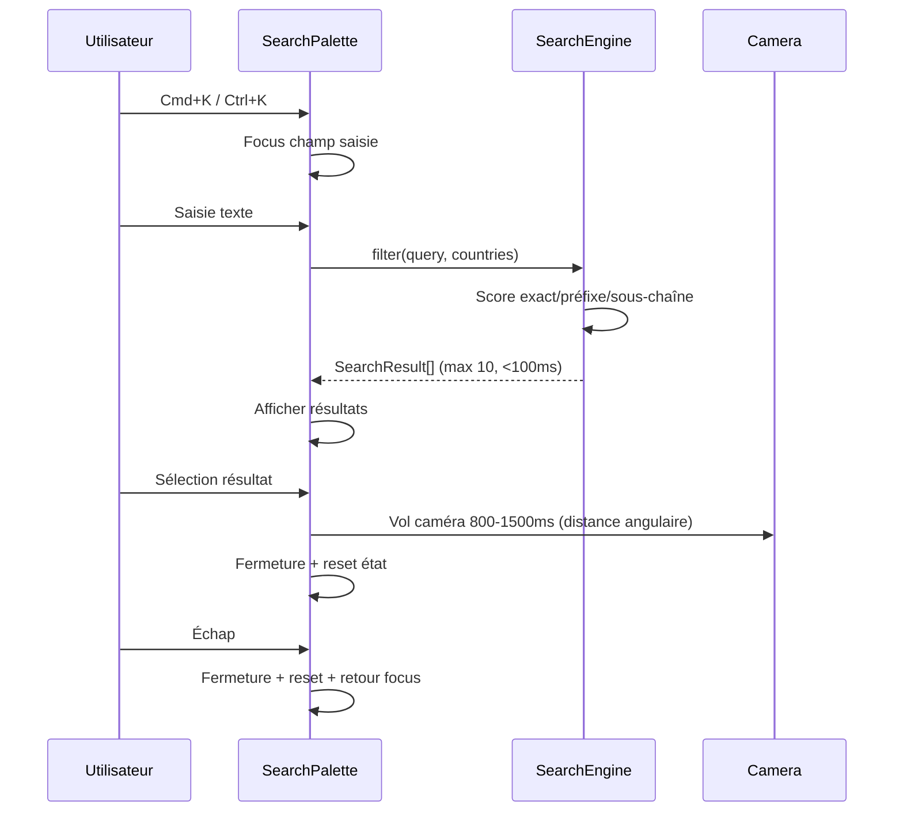
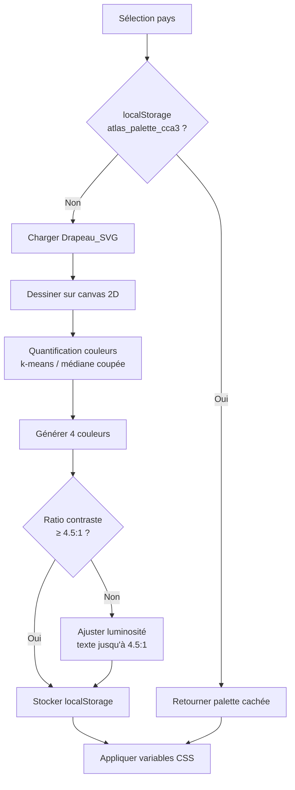
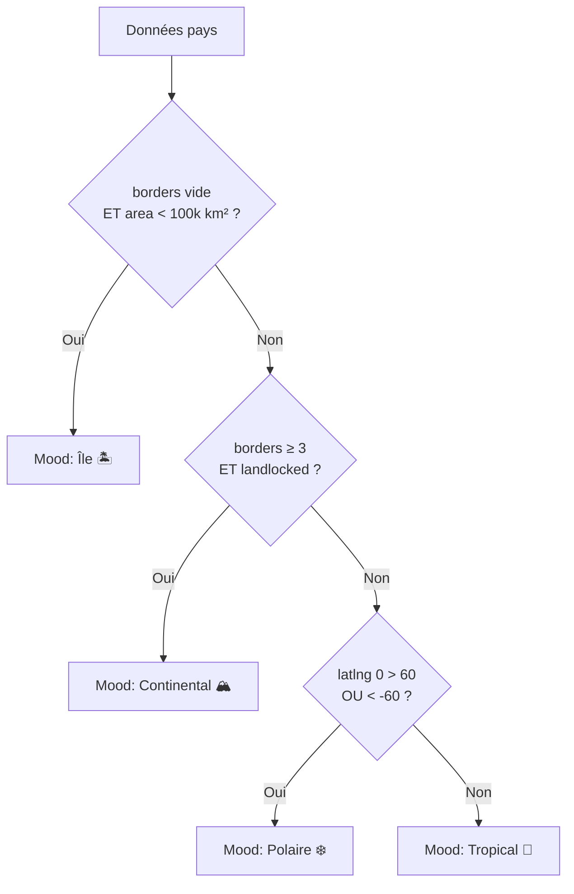

# Document de Design — ATLAS° Globe 3D Interactif

## Vue d'ensemble

ATLAS° est un explorateur mondial de pays sous forme de globe 3D interactif. L'application combine une expérience visuelle premium (Three.js/WebGL2, GSAP, Lenis) avec des données géographiques riches (REST Countries API v3.1, Natural Earth GeoJSON 110m) pour offrir une interface de découverte culturelle et géographique.

L'architecture repose sur **Next.js 14 App Router** avec génération statique (SSG) de 195 pages pays, un rendu 3D via **react-three-fiber**, et une couche d'animation orchestrée par **GSAP 3 + ScrollTrigger**.

---

## Architecture

### Diagramme de composants

```mermaid
graph TD
  subgraph "Next.js App Router"
    Layout["RootLayout\n(fonts, Lenis, Cursor)"]
    PageGlobe["page.tsx\n(route /)"]
    PagePays["page.tsx\n(route /pays/[code])"]
    GenerateStaticParams["generateStaticParams\n(195 pays)"]
  end

  subgraph "Composants Globe"
    GlobeScene["GlobeScene\n(Canvas r3f)"]
    GlobeMesh["GlobeMesh\n(sphère + pays)"]
    AtmosphereMesh["AtmosphereMesh\n(shader rim)"]
    StarField["StarField\n(10k points)"]
    GlobeControls["GlobeControls\n(OrbitControls)"]
    CountryMesh["CountryMesh\n(extrusion hover)"]
    Tooltip["Tooltip\n(drapeau + nom)"]
  end

  subgraph "Composants Country"
    CountryCard["CountryCard\n(layout fiche)"]
    FlagDisplay["FlagDisplay\n(SVG + animation)"]
    PopulationCloud["PopulationCloud\n(particules)"]
    AreaRect["AreaRect\n(rectangle to-scale)"]
    CapitalClock["CapitalClock\n(horloge temps réel)"]
    LanguageList["LanguageList\n(scripts natifs)"]
    CurrencyCard["CurrencyCard\n(3D flip)"]
    NeighborCards["NeighborCards\n(miniatures)"]
    RegionBadge["RegionBadge\n(badge + barre)"]
    TerminalInfo["TerminalInfo\n(indicatif + TLD)"]
    MoodDisplay["MoodDisplay\n(ambiance)"]
    MDXSection["MDXSection\n(contenu éditorial)"]
    Breadcrumb["Breadcrumb\n(fil d'Ariane)"]
    ShareButton["ShareButton\n(clipboard)"]
  end

  subgraph "Composants UI"
    LoadingScreen["LoadingScreen\n(séquence premium)"]
    SearchPalette["SearchPalette\n(Cmd+K)"]
    CustomCursor["CustomCursor\n(GSAP)"]
    SROnlyList["SROnlyList\n(accessibilité)"]
  end

  subgraph "Lib / Utilitaires"
    GeoJSONLoader["GeoJSONLoader\n(cache module)"]
    ColorExtractor["ColorExtractor\n(canvas 2D + localStorage)"]
    CountriesAPI["CountriesAPI\n(REST Countries v3.1)"]
    MDXLoader["MDXLoader\n(next-mdx-remote)"]
    SearchEngine["SearchEngine\n(filtrage client)"]
    ContrastChecker["ContrastChecker\n(WCAG)"]
    MoodResolver["MoodResolver\n(règles métier)"]
  end

  Layout --> PageGlobe
  Layout --> PagePays
  PageGlobe --> GlobeScene
  PageGlobe --> LoadingScreen
  PageGlobe --> SearchPalette
  PagePays --> CountryCard
  PagePays --> GenerateStaticParams

  GlobeScene --> GlobeMesh
  GlobeScene --> AtmosphereMesh
  GlobeScene --> StarField
  GlobeScene --> GlobeControls
  GlobeMesh --> CountryMesh
  GlobeMesh --> Tooltip

  CountryCard --> FlagDisplay
  CountryCard --> PopulationCloud
  CountryCard --> AreaRect
  CountryCard --> CapitalClock
  CountryCard --> LanguageList
  CountryCard --> CurrencyCard
  CountryCard --> NeighborCards
  CountryCard --> RegionBadge
  CountryCard --> TerminalInfo
  CountryCard --> MoodDisplay
  CountryCard --> MDXSection
  CountryCard --> Breadcrumb
  CountryCard --> ShareButton

  GlobeMesh --> GeoJSONLoader
  GlobeMesh --> ColorExtractor
  CountryCard --> ColorExtractor
  CountryCard --> ContrastChecker
  CountryCard --> MoodResolver
  GenerateStaticParams --> CountriesAPI
  MDXSection --> MDXLoader
  SearchPalette --> SearchEngine
  SearchEngine --> CountriesAPI
```



### Flux de navigation principal



---

## Structure des fichiers et modules

```
atlas/
├── app/
│   ├── layout.tsx                    # RootLayout : fonts, Lenis init, CustomCursor
│   ├── page.tsx                      # Page Globe (/)
│   ├── pays/
│   │   └── [code]/
│   │       └── page.tsx              # Page pays + generateStaticParams + metadata
│   └── globals.css                   # Variables CSS design tokens
│
├── components/
│   ├── globe/
│   │   ├── GlobeScene.tsx            # Canvas r3f, LoadingManager, caméra
│   │   ├── GlobeMesh.tsx             # Sphère principale + pays colorés
│   │   ├── CountryMesh.tsx           # Géométrie pays + extrusion hover
│   │   ├── AtmosphereMesh.tsx        # Shader rim lighting
│   │   ├── StarField.tsx             # 10k particules THREE.Points
│   │   ├── GlobeControls.tsx         # OrbitControls + damping
│   │   └── Tooltip.tsx               # Infobulle survol
│   │
│   ├── country/
│   │   ├── CountryCard.tsx           # Layout principal fiche pays
│   │   ├── FlagDisplay.tsx           # Drapeau SVG + animation entrée
│   │   ├── PopulationCloud.tsx       # Nuage de particules population
│   │   ├── AreaRect.tsx              # Rectangle superficie to-scale
│   │   ├── CapitalClock.tsx          # Horloge temps réel + jour/nuit
│   │   ├── LanguageList.tsx          # Langues en script natif
│   │   ├── CurrencyCard.tsx          # Monnaie avec effet 3D CSS
│   │   ├── NeighborCards.tsx         # Cartes miniatures pays voisins
│   │   ├── RegionBadge.tsx           # Badge continent + barre progression
│   │   ├── TerminalInfo.tsx          # Indicatif + TLD style terminal
│   │   ├── MoodDisplay.tsx           # Ambiance visuelle pays
│   │   ├── MDXSection.tsx            # Rendu contenu éditorial MDX
│   │   ├── Breadcrumb.tsx            # Fil d'Ariane navigation
│   │   └── ShareButton.tsx           # Bouton partage + clipboard
│   │
│   ├── ui/
│   │   ├── LoadingScreen.tsx         # Séquence chargement premium
│   │   ├── SearchPalette.tsx         # Palette recherche Cmd+K
│   │   ├── CustomCursor.tsx          # Curseur personnalisé GSAP
│   │   └── SROnlyList.tsx            # Liste sr-only accessibilité
│   │
│   └── layout/
│       └── Navigation.tsx            # Barre de navigation globale
│
├── content/
│   └── countries/
│       ├── BEN.mdx                   # Article éditorial Bénin
│       ├── FRA.mdx                   # Article éditorial France
│       └── ...                       # ≥ 20 pays au lancement
│
├── lib/
│   ├── geojson-loader.ts             # Chargement + cache module GeoJSON
│   ├── color-extractor.ts            # Extraction palette + localStorage
│   ├── contrast-checker.ts           # Calcul ratio contraste WCAG
│   ├── countries-api.ts              # Appels REST Countries API v3.1
│   ├── search-engine.ts              # Algorithme filtrage + classement
│   ├── mood-resolver.ts              # Règles métier ambiance pays
│   ├── mdx-loader.ts                 # Chargement + parsing MDX
│   └── gsap-config.ts                # Configuration GSAP + plugins
│
├── public/
│   ├── geodata/
│   │   └── ne_110m_admin_0_countries.geojson  # GeoJSON minifié
│   └── fonts/
│       ├── BebasNeue-Regular.woff2
│       ├── DMSans-Variable.woff2
│       └── JetBrainsMono-Variable.woff2
│
├── styles/
│   └── tokens.css                    # Variables CSS design tokens
│
└── shaders/
    ├── atmosphere.vert.glsl          # Vertex shader atmosphère
    └── atmosphere.frag.glsl          # Fragment shader rim lighting
```

---

## Modèles de données

### CountryData — Données REST Countries API

```typescript
interface CountryData {
  // Identifiants
  cca3: string;                        // Code Alpha-3 (ex: "BEN")
  cca2: string;                        // Code Alpha-2 (ex: "BJ")
  name: {
    common: string;                    // Nom courant (ex: "Benin")
    official: string;                  // Nom officiel
    nativeName: Record<string, {
      common: string;
      official: string;
    }>;
  };

  // Géographie
  capital: string[];                   // Capitales
  region: string;                      // Région (ex: "Africa")
  subregion: string;                   // Sous-région
  latlng: [number, number];            // [latitude, longitude]
  area: number;                        // Superficie en km²
  landlocked: boolean;                 // Enclavé
  borders: string[];                   // Codes Alpha-3 des voisins

  // Démographie et culture
  population: number;
  languages: Record<string, string>;   // { code: nom natif }
  currencies: Record<string, {
    name: string;
    symbol: string;
  }>;

  // Identifiants numériques
  idd: {
    root: string;                      // Ex: "+2"
    suffixes: string[];                // Ex: ["29"]
  };
  tld: string[];                       // Ex: [".bj"]

  // Médias
  flags: {
    svg: string;                       // URL drapeau SVG
    png: string;
    alt: string;
  };

  // Fuseaux horaires
  timezones: string[];                 // Ex: ["UTC+01:00"]
}
```

### CountryPalette — Palette de couleurs extraite

```typescript
interface CountryPalette {
  primary: string;     // Couleur dominante (hex)
  secondary: string;   // Deuxième couleur dominante
  accent: string;      // Couleur d'accent
  background: string;  // Couleur de fond dérivée

  // Métadonnées
  cca3: string;        // Code pays source
  source: 'extracted' | 'fallback';  // Origine de la palette
  contrastRatio: number;             // Ratio texte/fond calculé
}

// Clé localStorage : atlas_palette_[cca3]
// Valeur : JSON.stringify(CountryPalette)
```

### GeoJSONFeature — Données géographiques

```typescript
interface GeoJSONFeature {
  type: 'Feature';
  properties: {
    NAME: string;
    ISO_A3: string;      // Code Alpha-3
    ISO_A2: string;
    CONTINENT: string;
    SUBREGION: string;
  };
  geometry: {
    type: 'Polygon' | 'MultiPolygon';
    coordinates: number[][][] | number[][][][];
  };
}

interface GeoJSONCollection {
  type: 'FeatureCollection';
  features: GeoJSONFeature[];
}
```

### SearchResult — Résultat de recherche

```typescript
interface SearchResult {
  cca3: string;
  name: string;          // Nom courant
  officialName: string;  // Nom officiel
  capital: string;
  region: string;
  flagSvg: string;
  score: number;         // 3 = exact, 2 = préfixe, 1 = sous-chaîne
}
```

### CountryMood — Ambiance visuelle

```typescript
type MoodType = 'Île' | 'Continental' | 'Polaire' | 'Tropical';

interface CountryMood {
  type: MoodType;
  label: string;
  icon: string;          // Emoji ou icône SVG
  colorScheme: string;   // Classe CSS associée
}
```

### MDXContent — Contenu éditorial

```typescript
interface MDXContent {
  cca3: string;
  source: MDXRemoteSerializeResult | null;  // null si absent ou malformé
  frontmatter: {
    title?: string;
    description?: string;
    author?: string;
    date?: string;
  };
}
```

### LoadingState — État du chargement

```typescript
interface LoadingState {
  progress: number;          // 0-100
  phase: 'loading' | 'revealing' | 'complete';
  minDurationElapsed: boolean;  // true après 1.5s
  assetsLoaded: boolean;
}
```

---

## Flux de données et interactions

### 1. Initialisation et chargement



### 2. Interaction Globe → Fiche pays



### 3. Recherche pays



### 4. Extraction de palette et contraste



### 5. Résolution du Mood pays



---

## Décisions techniques clés

### 1. react-three-fiber plutôt que Three.js impératif

**Décision** : Utiliser `@react-three/fiber` et `@react-three/drei` comme couche d'abstraction React sur Three.js.

**Rationale** : L'intégration native avec le cycle de vie React (hooks, Suspense, Context) simplifie la gestion de l'état du globe et des interactions. `@react-three/drei` fournit `OrbitControls`, `Html` (pour les tooltips) et des helpers de performance (`PerformanceMonitor`) prêts à l'emploi. Le coût de performance est négligeable pour ce cas d'usage.

### 2. Génération statique pure (SSG) sans ISR

**Décision** : `generateStaticParams` + `export const dynamic = 'force-static'` pour les 195 pages pays.

**Rationale** : Les données REST Countries API sont stables (pas de mise à jour en temps réel nécessaire). Le SSG garantit un TTI ≤ 4s sur 4G, une disponibilité maximale (CDN Vercel), et un build fail-safe si l'API est indisponible après déploiement. L'ISR ajouterait de la complexité sans bénéfice réel.

### 3. Cache module pour le GeoJSON

**Décision** : Variable de module `let cachedGeoJSON: GeoJSONCollection | null = null` dans `geojson-loader.ts`.

**Rationale** : Le GeoJSON Natural Earth 110m (~500 KB minifié) ne doit être chargé qu'une seule fois par session. Un cache module (singleton) est plus simple et plus performant qu'un Context React ou un store global pour ce cas d'usage. Il persiste pour toute la durée de la session sans re-render.

### 4. localStorage pour les palettes de couleurs

**Décision** : Stocker les palettes extraites dans `localStorage` sous la clé `atlas_palette_[cca3]`.

**Rationale** : L'extraction de palette via canvas 2D est coûteuse (~50-100ms par pays). Le localStorage permet de persister les palettes entre sessions sans backend. La clé structurée `atlas_palette_[cca3]` évite les collisions et facilite le débogage.

### 5. Shaders GLSL inline vs fichiers externes

**Décision** : Shaders atmosphère dans des fichiers `.glsl` séparés importés via webpack raw-loader.

**Rationale** : Séparer les shaders dans des fichiers `.glsl` améliore la lisibilité, permet la coloration syntaxique dans les éditeurs, et facilite les itérations sur les effets visuels sans modifier les composants React.

### 6. GSAP `quickSetter` pour le curseur

**Décision** : Utiliser `gsap.quickSetter` pour les mises à jour de position du curseur personnalisé.

**Rationale** : `quickSetter` est optimisé pour les mises à jour haute fréquence (60fps+) en évitant la création d'objets GSAP à chaque frame. Le lag de 80ms est implémenté via une interpolation linéaire dans le `requestAnimationFrame`.

### 7. Algorithme de recherche côté client

**Décision** : Filtrage et classement entièrement côté client sur les 195 pays préchargés.

**Rationale** : 195 pays est un dataset suffisamment petit pour un filtrage en mémoire en < 100ms. Pas besoin d'un moteur de recherche externe (Algolia, Fuse.js) — un algorithme de scoring simple (exact=3, préfixe=2, sous-chaîne=1) suffit et évite une dépendance supplémentaire.

### 8. Synchronisation Lenis + ScrollTrigger

**Décision** : Utiliser `ScrollTrigger.scrollerProxy` avec les callbacks Lenis.

**Rationale** : GSAP ScrollTrigger écoute les événements de scroll natifs par défaut. Lenis intercepte ces événements et produit un scroll virtuel. `scrollerProxy` permet à ScrollTrigger d'utiliser la position de scroll Lenis comme référence, garantissant la synchronisation des animations avec le scroll fluide.

### 9. Pixel ratio adaptatif

**Décision** : `Math.min(devicePixelRatio, 2.0)` desktop, `Math.min(devicePixelRatio, 1.5)` mobile.

**Rationale** : Les écrans Retina/HiDPI ont des DPR de 2-3. Rendre à DPR 3 quadruple la charge GPU sans gain visuel perceptible. Le plafond à 2.0 (desktop) et 1.5 (mobile) maintient la qualité visuelle tout en garantissant ≥55 FPS sur GPU intégré Intel UHD 620.

### 10. Contraste dynamique WCAG

**Décision** : Ajustement automatique de la luminosité HSL jusqu'à atteindre le ratio WCAG requis.

**Rationale** : Les palettes extraites des drapeaux peuvent produire des combinaisons texte/fond à faible contraste. L'ajustement automatique via manipulation HSL (augmenter/diminuer la luminosité) garantit l'accessibilité sans intervention manuelle pour chacun des 195 pays.

---

## Gestion des erreurs

### Hiérarchie des fallbacks

| Composant | Condition d'erreur | Comportement de repli |
|-----------|-------------------|----------------------|
| GlobeScene | WebGL2 non supporté | Liste HTML 195 pays (sr-only visible) |
| ColorExtractor | Drapeau SVG indisponible | Palette fallback `#1E3A5F / #2D5986 / #4A90D9 / #0A0A14` |
| ColorExtractor | Contraste insuffisant | Ajustement luminosité HSL automatique |
| MDXLoader | Fichier absent | Affichage données structurées uniquement |
| MDXLoader | Fichier malformé | Log build + page sans contenu éditorial |
| REST Countries API | Indisponible au build | Interruption build + log erreur explicite |
| Clipboard API | Non disponible | Champ texte sélectionnable avec URL |
| GeoJSONLoader | Erreur réseau | Affichage globe sans frontières + log console |

### Stratégie de gestion des erreurs Three.js

```typescript
// GlobeScene.tsx — Détection WebGL2
const canvas = document.createElement('canvas');
const gl = canvas.getContext('webgl2');
if (!gl) {
  // Afficher SROnlyList comme contenu principal
  setWebGLSupported(false);
  return;
}
```

### Gestion des erreurs de build

```typescript
// app/pays/[code]/page.tsx
export async function generateStaticParams() {
  try {
    const countries = await fetchAllCountries();
    return countries.map(c => ({ code: c.cca3.toLowerCase() }));
  } catch (error) {
    // Interruption build — pas de déploiement partiel
    throw new Error(
      `[ATLAS] Impossible de récupérer les données REST Countries API: ${error.message}`
    );
  }
}
```

---

## Stratégie de test

### Approche duale

L'application combine des **tests unitaires** (exemples concrets, cas limites) et des **tests basés sur les propriétés** (propriétés universelles sur l'espace d'entrée).

**Tests unitaires** — cas d'usage :
- Rendu de composants avec des données fixes (snapshot tests)
- Comportements spécifiques (ouverture/fermeture SearchPalette)
- Cas limites (pays sans voisins, superficie nulle, drapeau manquant)
- Points d'intégration entre composants

**Tests basés sur les propriétés** — cas d'usage :
- Algorithme de recherche (classement, filtrage)
- Extraction et ajustement de palette (contraste WCAG)
- Résolution du Mood pays (règles métier)
- Calcul de superficie relative
- Comptage de particules population

**Bibliothèque PBT** : `fast-check` (TypeScript natif, intégration Jest/Vitest)

**Configuration** : Minimum 100 itérations par test de propriété.

**Format de tag** : `// Feature: atlas-globe-3d, Property N: [texte de la propriété]`

