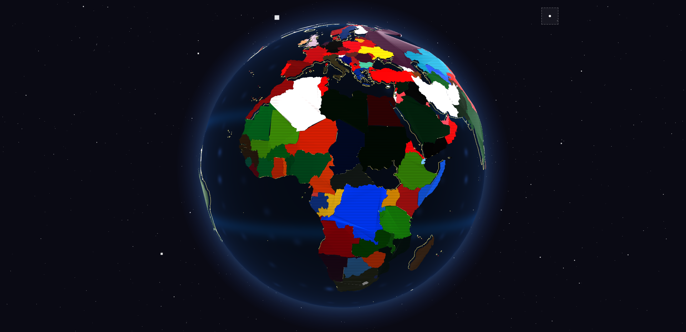
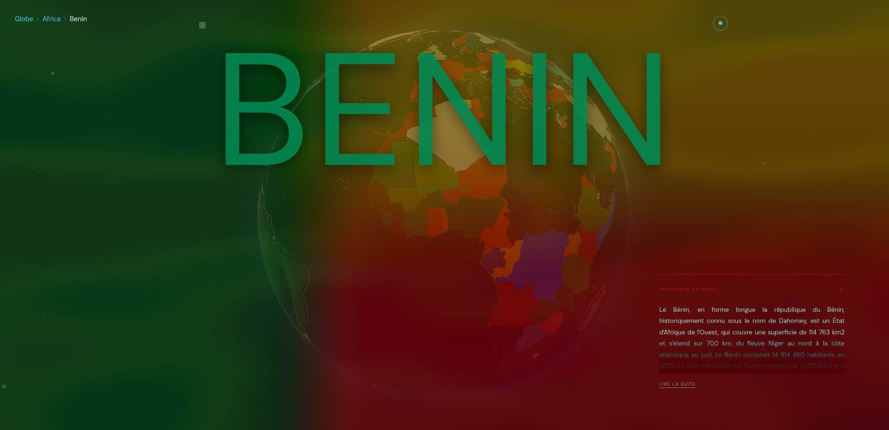
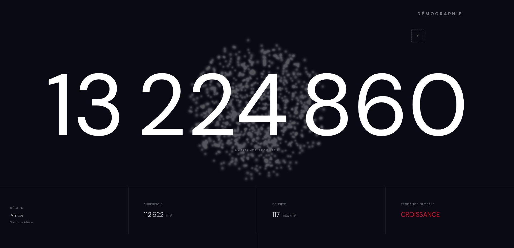
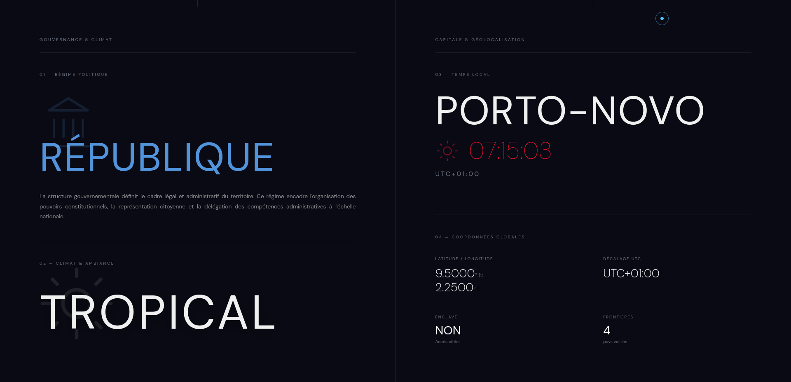
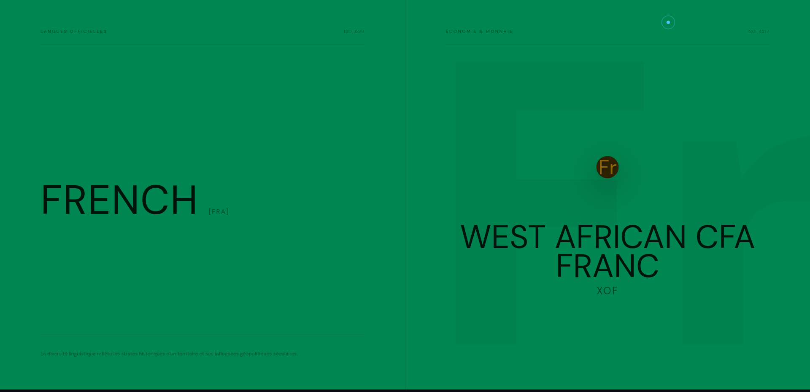
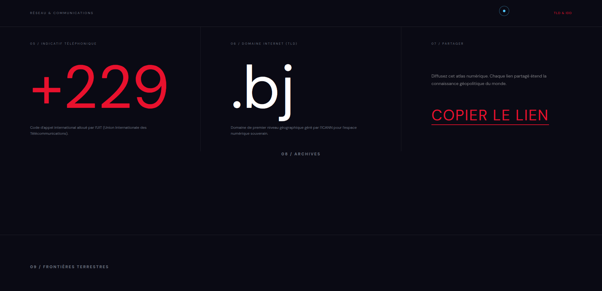
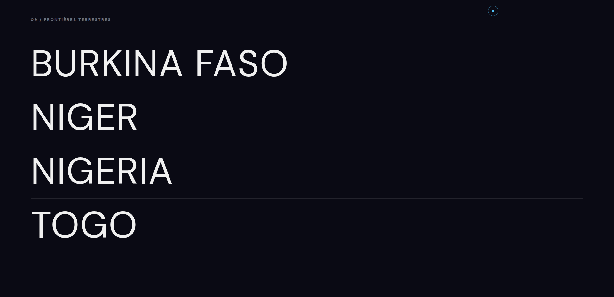

<div align="center">

# atlas

**Globe 3D interactif · les 193 États du monde**

[](https://nextjs.org)
[](https://threejs.org)
[](https://typescriptlang.org)
[](https://gsap.com)
[](./LICENSE)

</div>



---

## À propos

atlas est un explorateur mondial de pays construit autour d'un globe 3D WebGL.  
Le périmètre est celui des 193 États membres de l'ONU (filtre `unMember` de mledoze/countries, Saint-Siège exclu car simple observateur). La Terre est photoréaliste ; chaque pays révèle au survol la couleur dominante de son drapeau, calculée au build (k-means) et figée dans le GeoJSON. L'objectif est de prouver qu'une expérience de premier rang peut reposer entièrement sur des fondations statiques, ouvertes et sans backend propriétaire.

Projet personnel de [BADAROU Mouwafic](https://github.com/mouwaficbdr). Aucune vocation commerciale.

---

## Fonctionnalités

- **Terre photoréaliste** : textures NASA Blue Marble (jour, relief, lumières des villes côté nuit), nuages, atmosphère en diffusion de Rayleigh (limbe bleu, crépuscule doré au terminateur), ciel profond avec Voie lactée et étoiles aux couleurs stellaires
- **Globe interactif** : rotation et zoom libres, survol qui teinte et détoure le pays, vol de caméra GSAP vers le pays choisi
- **Couleurs générées** : chaque pays porte la palette de son drapeau, calculée au build (k-means) et figée dans le GeoJSON
- **Fiche pays complète** : démographie, gouvernance, capitale en temps réel, langues, monnaie, indicatif, domaine TLD, frontières voisines
- **Extrait Wikipédia** : résumé encyclopédique en français (cascade FR puis EN, cache Next.js 24 h), récupéré au build avec repli silencieux
- **Recherche instantanée** : depuis l'étoile de l'écran de départ ou ⌘K, filtrée côté client, insensible aux accents et aux noms français
- **Arrivée « Pale Blue Dot »** : la Terre n'est qu'un point pendant le chargement réel, puis la caméra s'en approche ; guidage progressif et discret à la première visite
- **Navigation responsive** : globe WebGL sur desktop, index mobile avec recherche et navigation par continent
- **SSG pur** : 193 pages statiques pré-générées au build, aucun appel réseau au runtime pour les données pays

---

## Aperçu

<table>
  <tr>
    <td width="50%">
      
      <p align="center"><sub>Hero pays : palette générée depuis le drapeau</sub></p>
    </td>
    <td width="50%">
      
      <p align="center"><sub>Démographie : nuage de particules et données clés</sub></p>
    </td>
  </tr>
  <tr>
    <td width="50%">
      
      <p align="center"><sub>Régime politique, ambiance climatique et horloge locale en temps réel</sub></p>
    </td>
    <td width="50%">
      
      <p align="center"><sub>Langues officielles et monnaie, fond issu du drapeau</sub></p>
    </td>
  </tr>
  <tr>
    <td width="50%">
      
      <p align="center"><sub>Indicatif téléphonique, domaine TLD et partage</sub></p>
    </td>
    <td width="50%">
      
      <p align="center"><sub>Frontières terrestres : pays voisins cliquables</sub></p>
    </td>
  </tr>
</table>

---

## Stack technique

| Couche | Technologie | Version |
|---|---|---|
| Framework | Next.js App Router + TypeScript | 14.2 / TS 5 |
| 3D / WebGL | Three.js + react-three-fiber | 0.170 / 8.17 |
| Animation | GSAP 3 + ScrollTrigger | 3.12 |
| État global | Zustand | 5.0 |
| Smooth scroll | Lenis | 1.1 |
| Contenu éditorial | MDX + next-mdx-remote | 6.0 |
| Triangulation | earcut | 3.0 |
| Tests | Vitest + fast-check | 4.1 |

**Sources de données**

| Source | Données | Accès |
|---|---|---|
| [mledoze/countries](https://github.com/mledoze/countries) | Noms FR, gentilés, capitale, monnaies, langues, indicatif, TLD, voisins, appartenance à l'ONU | Vendoré dans `scripts/vendor/`, figé au build |
| [countries-and-timezones](https://www.npmjs.com/package/countries-and-timezones) | Fuseau IANA de la capitale (gère l'heure d'été) | Dépendance npm, utilisée à la génération |
| [Wikidata (SPARQL)](https://query.wikidata.org) | Forme de gouvernement (P122), libellé français | Vendoré dans `scripts/vendor/`, figé au build |
| [Banque mondiale](https://data.worldbank.org/indicator/SP.POP.TOTL) | Population (dernière année publiée, affichée sur la fiche) | Vendoré dans `scripts/vendor/`, figé au build |
| [Natural Earth 110m](https://www.naturalearthdata.com) | Géométrie des frontières (GeoJSON) | Fichier statique, domaine public |
| [NASA Blue Marble](https://visibleearth.nasa.gov) via les exemples [three.js](https://github.com/mrdoob/three.js/tree/dev/examples/textures/planets) | Textures de la Terre (jour, nuit, relief, nuages) | `public/textures/earth/`, domaine public / MIT |
| [Wikipedia REST API](https://fr.wikipedia.org/api/rest_v1/) | Extraits encyclopédiques (cascade FR puis EN) | Récupéré au build, cache Next.js 24h, repli silencieux |
| MDX local | Articles éditoriaux par pays | `/content/countries/[cca3].mdx` |

Les données pays sont figées dans le dépôt (`public/data/countries-geo.json` + `scripts/vendor/`). Aucune base de données. Aucun backend propriétaire. Aucun appel réseau au runtime.

---

## Architecture

```
atlas/
├── app/
│   ├── layout.tsx              # RootLayout, polices, métadonnées
│   ├── page.tsx                # Page d'accueil (globe)
│   ├── opengraph-image.tsx     # Image OG générée (site et par pays)
│   ├── not-found.tsx           # 404 dans l'univers atlas
│   └── pays/[code]/            # 193 pages SSG et leur chargement
├── components/
│   ├── globe/                  # GlobeScene, EarthMesh, CloudsMesh, AtmosphereMesh,
│   │                           #   StarField, BordersMesh, HoverHighlight, CameraTransition
│   ├── country/                # CountryCard et ses panneaux, CountryFooter
│   ├── ui/                     # SearchPalette, LoadingScreen, GlobeOnboarding, OffMapScreen...
│   └── layout/                 # PersistentLayout, Navigation (étoile de recherche)
├── lib/                        # search-engine, geojson-loader, i18n-country, mood-resolver...
│   └── globe/                  # sélection des pays, soleil, intro caméra, textures
├── content/countries/          # Fichiers MDX éditoriaux ([cca3].mdx)
├── public/data/                # countries-geo.json (géométrie et propriétés figées)
├── public/textures/earth/      # Textures NASA de la Terre
├── scripts/                    # generate-geo.js, fetch-vendor-data.js, vendor/
└── shaders/                    # GLSL : atmosphère, nuages, ciel, étoiles
```

**Flux de données**

1. **Vendoring** (manuel, hors build) : `scripts/fetch-vendor-data.js` fige mledoze/countries et la forme de gouvernement Wikidata dans `scripts/vendor/`
2. **Génération** (manuel, hors build) : `scripts/generate-geo.js` reconstruit `public/data/countries-geo.json` : filtre aux États membres de l'ONU, noms, langues et monnaies en français, fuseaux IANA, indicatif, TLD, palette k-means, centroïde, passe géométrie
3. **Build** : `generateStaticParams` lit les 193 codes du GeoJSON et pré-génère toutes les routes ; seul l'extrait Wikipédia est récupéré en ligne (repli silencieux)
4. **Runtime SSG** : les données complètes de chaque pays sont injectées statiquement dans la page ; le client ne fait aucun appel réseau de données
5. **Client** : le GeoJSON est chargé une fois au montage du globe et mis en cache en mémoire (singleton)

---

## Installation

```bash
git clone https://github.com/mouwaficbdr/atlas.git
cd atlas
npm install
npm run dev
```

L'application tourne sur [http://localhost:3000](http://localhost:3000).

**Build de production**

```bash
npm run build
npm start
```

> **Note** : le build génère les 193 pages statiques via `generateStaticParams`. Les données pays sont figées dans le dépôt ; seul l'extrait Wikipédia est récupéré au build, avec repli silencieux si l'API est indisponible.

**Régénérer les données pays**

```bash
node scripts/fetch-vendor-data.js   # rafraîchit scripts/vendor/ (réseau)
node scripts/generate-geo.js        # reconstruit public/data/countries-geo.json (hors ligne)
```

---

## Tests

```bash
npm test           # vitest run
npm run test:watch # vitest (mode watch)
```

Les tests couvrent les fonctions critiques : moteur de recherche (fuzzy matching, insensibilité aux accents et aux noms français), sélection d'un pays sur le globe (inversion de projection, point-in-polygon), formatage des coordonnées, vérificateur de contraste WCAG 2.1 et résolution d'ambiances pays.

---

## Licence

[MIT](./LICENSE), BADAROU Mouwafic, 2026
