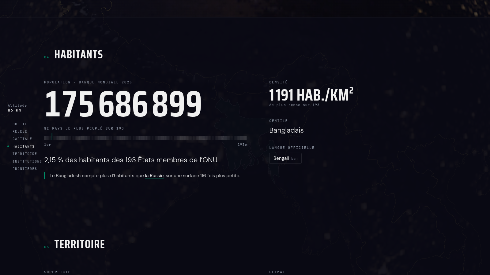
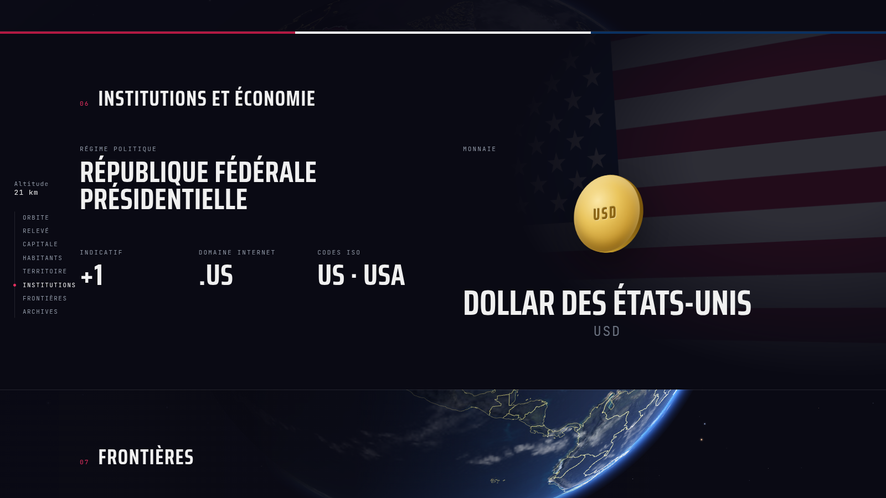
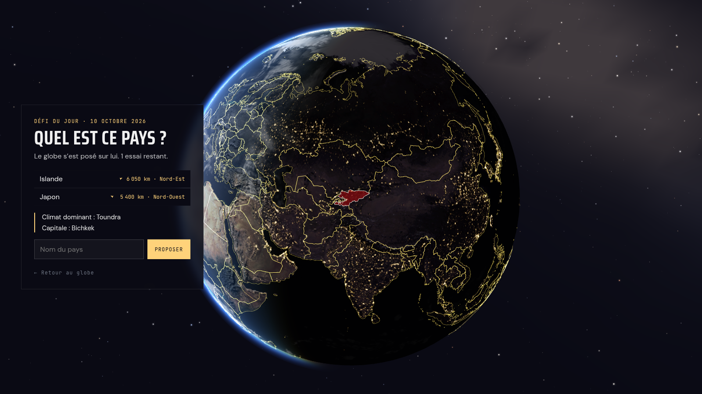
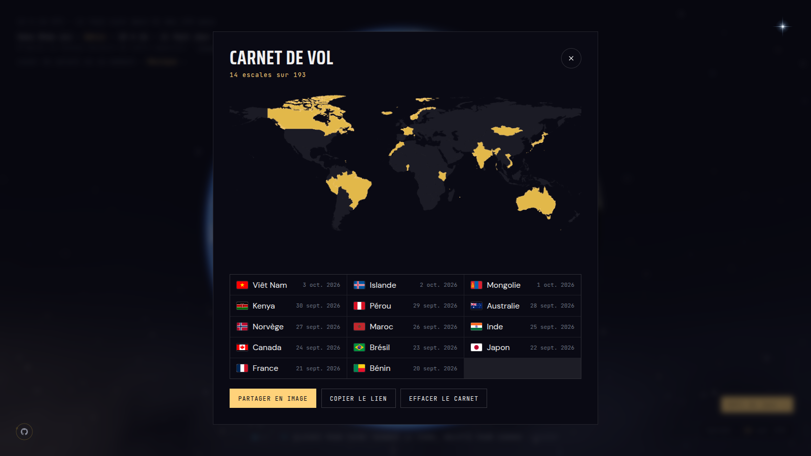
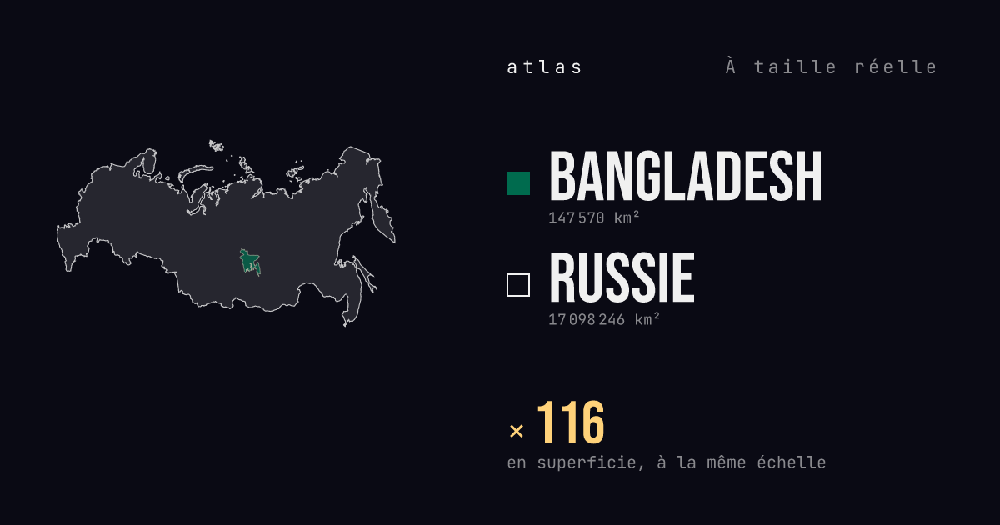

<div align="center">

# atlas

**Globe 3D interactif · les 193 États du monde**

[](https://nextjs.org)
[](https://threejs.org)
[](https://typescriptlang.org)
[](https://gsap.com)
[](./LICENSE)

**[atlas.mouwaficbdr.me](https://atlas.mouwaficbdr.me)**

</div>


---

## À propos

atlas est un explorateur mondial de pays construit autour d'un globe 3D WebGL.  
Le périmètre est celui des 193 États membres de l'ONU (filtre `unMember` de mledoze/countries, Saint-Siège exclu car simple observateur). La Terre est photoréaliste ; chaque pays révèle au survol la couleur dominante de son drapeau, extraite des pixels du drapeau et figée dans le GeoJSON. L'objectif est de prouver qu'une expérience de premier rang peut reposer entièrement sur des fondations statiques, ouvertes et sans backend propriétaire.

---

## Fonctionnalités

**Le globe**

- **Terre photoréaliste, vrai soleil** : textures NASA Blue Marble (jour, relief, lumières des villes côté nuit), nuages, atmosphère en diffusion de Rayleigh ; le jour et la nuit affichés sont ceux de l'instant présent (point subsolaire calculé, recalé toutes les 30 s)
- **Le soleil dit en clair** : heure UTC et nombre de pays dans la nuit ; au survol d'un pays posé sur le terminateur, son aube ou son crépuscule et son heure locale ; le pays où le soleil se lève en ce moment, qu'un clic amène face à soi
- **« Vous êtes ici »** : le pays de l'utilisateur est déduit du fuseau horaire de l'appareil (sans géolocalisation ni envoi de données), modifiable d'un geste ; l'arrivée du globe vise ce pays et les fiches s'y rapportent
- **Globe interactif** : rotation et zoom libres, survol qui teinte et détoure le pays aux couleurs réelles de son drapeau, vol de caméra vers le pays choisi ; sur mobile, inclinaison du globe avec le téléphone (option)
- **Arrivée « Pale Blue Dot »** : la Terre n'est qu'un point pendant le chargement réel, puis la caméra s'en approche

**Les fiches**

- **Transition continue** : le nom du pays passe de son étiquette 3D au titre de la fiche pendant que la caméra plonge, et revient sur le globe au retour
- **Descente orbitale réelle** : le défilement pilote la caméra (orbite, plongée, survol rasant de la capitale, remontée aux frontières) ; rail de sommaire avec altimètre
- **Relevé, capitale, habitants, territoire, institutions et économie, frontières, archives** : heure et ciel de la capitale, écart horaire et superficie rapportés au pays de l'utilisateur, règles de rang sur 193 explorables au survol, section institutions composée à partir du drapeau, voisins avec boussole
- **Contrastes calculés** : une ou deux comparaisons qui étonnent, tirées uniquement des données (« Le Bangladesh compte plus d'habitants que la Russie, sur une surface 116 fois plus petite »)
- **Climat de Köppen-Geiger** : les trois climats principaux de chaque pays et leur part du territoire (carte 1991-2020 de Beck et al.)
- **Comparateur à taille réelle** : deux pays superposés à la même échelle en projection équivalente de Lambert, sans la dilatation de Mercator ; réglé par défaut sur le pays de l'utilisateur
- **Extrait Wikipédia** : résumé encyclopédique en français, récupéré au build avec nouvel essai et repli silencieux
- **Typographie variable** : la chasse du titre s'adapte à la longueur du nom (« TCHAD » large, « SAINT-VINCENT-ET-LES-GRENADINES » serré)

**Jouer et partager**

- **Défi du jour** : le globe se pose sur un pays, le même pour tous ce jour-là ; trois essais, avec direction et distance, puis climat, puis capitale ; résultat partageable sans révéler la réponse
- **Carnet de vol** : chaque fiche lue jusqu'au bout laisse un tampon ; les pays explorés gardent un liseré doré sur le globe ; carnet gardé sur l'appareil, partageable en image ou en lien, effaçable à tout moment (ni série ni rappel)
- **Aperçus de partage illustrés** : chaque fiche, comparaison, carnet ou résultat du défi a sa propre image Open Graph
- **Recherche instantanée** : depuis l'étoile de l'écran de départ, ⌘K ou en tapant simplement un nom sur le globe ; insensible aux accents et aux noms français

**Partout**

- **Mobile** : le vrai globe, cadré pour le portrait ; tiroir à portée du pouce (recherche, défi, pays au hasard, continents, carnet) et aperçu d'un pays au toucher
- **Statique et rafraîchi** : 193 pages pré-générées au build puis régénérées au plus une fois par jour (extrait Wikipédia à jour) ; sources de données réextraites chaque semaine par une tâche planifiée qui propose une PR ; aucun appel réseau côté visiteur pour les données pays

---

## Aperçu

<sub>Captures prises en production le 10 octobre 2026 vers 14 h 10 UTC, depuis un appareil réglé sur le fuseau du Bénin : l'éclairage est celui du vrai soleil à cet instant.</sub>

<table>
  <tr>
    <td colspan="2">
      
      <p align="center"><sub>Orbite : le Japon de nuit (23 h 10 à Tokyo), le titre à la chasse adaptée au nom</sub></p>
    </td>
  </tr>
  <tr>
    <td width="50%">
      
      <p align="center"><sub>Relevé : l'essentiel d'un coup d'œil</sub></p>
    </td>
    <td width="50%">
      
      <p align="center"><sub>Capitale : la caméra rase la capitale, repère doré, écart horaire avec chez soi</sub></p>
    </td>
  </tr>
  <tr>
    <td width="50%">
      
      <p align="center"><sub>Habitants : le contraste qui étonne, calculé sur les données</sub></p>
    </td>
    <td width="50%">
      
      <p align="center"><sub>Territoire : rang sur 193, superficie rapportée à chez soi, climats</sub></p>
    </td>
  </tr>
  <tr>
    <td width="50%">
      
      <p align="center"><sub>Institutions : la section composée à partir du drapeau</sub></p>
    </td>
    <td width="50%">
      
      <p align="center"><sub>À taille réelle : le Brésil sur les États-Unis contigus</sub></p>
    </td>
  </tr>
  <tr>
    <td colspan="2">
      
      <p align="center"><sub>Frontières : survoler un voisin l'allume sur le globe</sub></p>
    </td>
  </tr>
  <tr>
    <td width="50%">
      
      <p align="center"><sub>Défi du jour : le globe se pose sur un pays mystère</sub></p>
    </td>
    <td width="50%">
      
      <p align="center"><sub>Carnet de vol : les escales, gardées sur l'appareil</sub></p>
    </td>
  </tr>
  <tr>
    <td colspan="2">
      
      <p align="center"><sub>Aperçu de partage d'une comparaison, rendu à la demande</sub></p>
    </td>
  </tr>
  <tr>
    <td colspan="2">
      
      <p align="center"><sub>Mobile : le vrai globe, le tiroir, l'aperçu au toucher, la fiche</sub></p>
    </td>
  </tr>
</table>

---

## Stack technique

| Couche | Technologie | Version |
|---|---|---|
| Framework | Next.js App Router + TypeScript | 14.2 / TS 5 |
| 3D / WebGL | Three.js + react-three-fiber | 0.170 / 8.17 |
| Animation | GSAP 3 + ScrollTrigger | 3.12 |
| État global | Zustand | 5.0 |
| Smooth scroll | Lenis | 1.1 |
| Contenu éditorial | MDX + next-mdx-remote | 6.0 |
| Triangulation | earcut | 3.0 |
| Tests | Vitest + fast-check | 4.1 |

**Sources de données**

| Source | Données | Accès |
|---|---|---|
| [mledoze/countries](https://github.com/mledoze/countries) | Noms FR, gentilés, capitale, monnaies, langues, indicatif, TLD, voisins, appartenance à l'ONU | Vendoré dans `scripts/vendor/`, figé au build |
| [countries-and-timezones](https://www.npmjs.com/package/countries-and-timezones) | Fuseau IANA de la capitale (gère l'heure d'été) | Dépendance npm, utilisée à la génération |
| [Wikidata (SPARQL)](https://query.wikidata.org) | Forme de gouvernement (P122), libellé français ; coordonnées des capitales (P36, P625) | Vendoré dans `scripts/vendor/`, figé au build |
| [Banque mondiale](https://data.worldbank.org/indicator/SP.POP.TOTL) | Population (dernière année publiée, affichée sur la fiche) | Vendoré dans `scripts/vendor/`, figé au build |
| [Beck et al. 2023](https://doi.org/10.1038/s41597-023-02549-6), *Scientific Data* 10, 724 | Climats de Köppen-Geiger 1991-2020 (carte à 0,1°), trois classes principales par pays | Calculé par `scripts/compute-koppen.mjs`, vendoré dans `scripts/vendor/koppen.json` |
| [Natural Earth 1:50m](https://www.naturalearthdata.com) | Géométrie des frontières (GeoJSON) | Fichier statique, domaine public |
| [NASA Blue Marble](https://visibleearth.nasa.gov) via les exemples [three.js](https://github.com/mrdoob/three.js/tree/dev/examples/textures/planets) | Textures de la Terre (jour, nuit, relief, nuages) | `public/textures/earth/`, domaine public / MIT |
| [Wikipedia REST API](https://fr.wikipedia.org/api/rest_v1/) | Extraits encyclopédiques (cascade FR puis EN) | Récupéré au build puis rafraîchi chaque jour (ISR), repli silencieux |
| MDX local | Articles éditoriaux par pays | `/content/countries/[cca3].mdx` |

Les données pays sont versionnées dans le dépôt (`public/data/countries-geo.json` + `scripts/vendor/`) et rafraîchies chaque lundi par le workflow `rafraichissement-donnees.yml`, qui ouvre une PR à relire quand une source a changé. Aucune base de données. Aucun backend propriétaire.

---

## Architecture

```
atlas/
├── app/
│   ├── layout.tsx              # RootLayout, polices, métadonnées
│   ├── page.tsx                # Page d'accueil (globe)
│   ├── opengraph-image.tsx     # Image OG générée (site et par pays)
│   ├── not-found.tsx           # 404 dans l'univers atlas
│   ├── pays/[code]/            # 193 pages SSG et leur chargement
│   ├── defi/                   # Défi du jour, et ses résultats partagés (/defi/[jour]/[grille])
│   ├── comparer/[pair]/        # Comparaison partagée et son image (/comparer/fra-bra)
│   └── carnet/[codes]/         # Carnet partagé et son image (/carnet/ben-fra)
├── components/
│   ├── globe/                  # GlobeScene, EarthMesh, CloudsMesh, AtmosphereMesh,
│   │                           #   StarField, BordersMesh, HoverHighlight, CameraTransition,
│   │                           #   HolographicText, CapitalMarker
│   ├── country/                # CountryCard (descente orbitale), DescentRail, CapitalSky,
│   │                           #   ClimateDisplay, TrueSizeCompare, NeighborCards, CountryFooter,
│   │                           #   RankRuler, FlightStamp
│   ├── ui/                     # SearchPalette, LoadingScreen, GlobeOnboarding, MobileHomeDock,
│   │                           #   MobileExplorer, OffMapScreen, SunLine, Logbook,
│   │                           #   DailyChallenge, SharedLogbook...
│   └── layout/                 # PersistentLayout, Navigation (étoile de recherche)
├── lib/                        # search-engine, geojson-loader, solar et solar-now (soleil),
│   │                           #   koppen, true-size (projection de Lambert), bearing, contrasts,
│   │                           #   fr-names (articles), home-country et from-home (« Vous êtes
│   │                           #   ici »), logbook, daily (défi), share-urls, device-tilt...
│   ├── data/                   # timezone-country.json (fuseau IANA → pays, généré)
│   └── globe/                  # sélection des pays, soleil, intro caméra, textures
├── content/countries/          # Fichiers MDX éditoriaux ([cca3].mdx)
├── public/data/                # countries-geo.json (géométrie et propriétés figées)
├── public/textures/earth/      # Textures NASA de la Terre
├── scripts/                    # generate-geo.js, fetch-vendor-data.js, compute-koppen.mjs, compute-flag-colors.mjs, vendor/
└── shaders/                    # GLSL : atmosphère, nuages, ciel, étoiles
```

**Flux de données**

1. **Vendoring** (chaque lundi par GitHub Actions, ou à la main) : `scripts/fetch-vendor-data.js` fige mledoze/countries, la forme de gouvernement et les capitales (Wikidata) et la population (Banque mondiale) dans `scripts/vendor/` ; `scripts/compute-koppen.mjs` y calcule les climats depuis la carte de Beck et al. et `scripts/compute-flag-colors.mjs` les couleurs des drapeaux (couleurs réellement présentes, jamais des moyennes)
2. **Génération** (dans la même tâche, ou à la main) : `scripts/generate-geo.js` reconstruit `public/data/countries-geo.json` : filtre aux États membres de l'ONU, noms, langues et monnaies en français, fuseaux IANA, indicatif, TLD, couleurs du drapeau, centroïde, passe géométrie
3. **Build** : `generateStaticParams` lit les 193 codes du GeoJSON et pré-génère toutes les fiches ; seul l'extrait Wikipédia est récupéré en ligne (repli silencieux). Les liens partagés (`/comparer`, `/carnet`, `/defi/[jour]/[grille]`) sont rendus à la demande, leurs fichiers de données et polices embarqués par `outputFileTracingIncludes`
4. **Runtime SSG** : les données complètes de chaque pays sont injectées statiquement dans la page ; le client ne fait aucun appel réseau de données
5. **Client** : le GeoJSON est chargé une fois au montage du globe et mis en cache en mémoire (singleton) ; le pays de l'utilisateur, le carnet et la partie du défi restent sur l'appareil (`localStorage`), jamais envoyés

---

## Installation

```bash
git clone https://github.com/mouwaficbdr/atlas.git
cd atlas
npm install
npm run dev
```

L'application tourne sur [http://localhost:3000](http://localhost:3000).

**Build de production**

```bash
npm run build
npm start
```

> **Note** : le build génère les 193 pages statiques via `generateStaticParams`. Les données pays sont figées dans le dépôt ; seul l'extrait Wikipédia est récupéré au build, avec repli silencieux si l'API est indisponible.

**Régénérer les données pays**

```bash
node scripts/fetch-vendor-data.js   # rafraîchit scripts/vendor/ (réseau)
node scripts/generate-geo.js        # reconstruit public/data/countries-geo.json (hors ligne)
```

---

## Tests

```bash
npm test           # vitest run
npm run test:watch # vitest (mode watch)
```

Les tests couvrent les fonctions critiques : moteur de recherche (fuzzy matching, insensibilité aux accents et aux noms français), sélection d'un pays sur le globe (inversion de projection, point-in-polygon), position du soleil (solstices, équinoxe, lever et coucher, jours polaires, pays dans la nuit, lever en cours), projection équivalente du comparateur, cadrage du globe en portrait, couverture des données des 193 pays, extraction des couleurs de drapeau, contrastes calculés et articles français, pays de l'utilisateur (fuseaux et alias, écart horaire, superficie), carnet de vol, tirage et indices du défi, validation des liens partagés (entrées non fiables), formatage des coordonnées et vérificateur de contraste WCAG 2.1.

---

## Licence

[MIT](./LICENSE)
