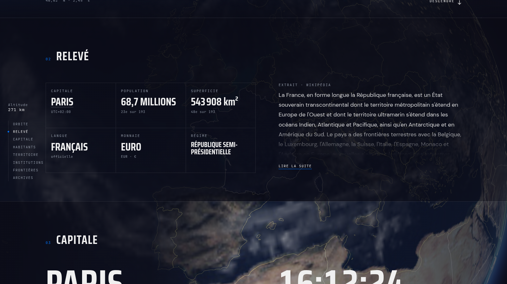
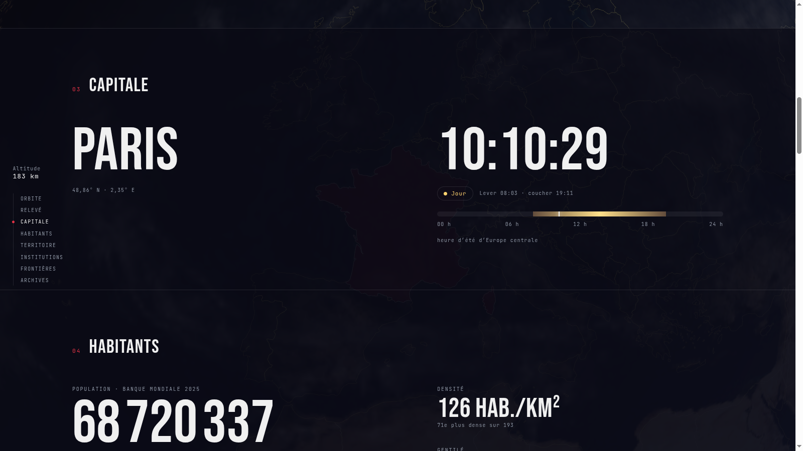
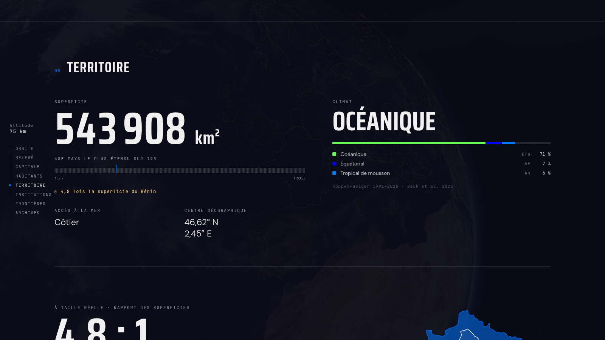
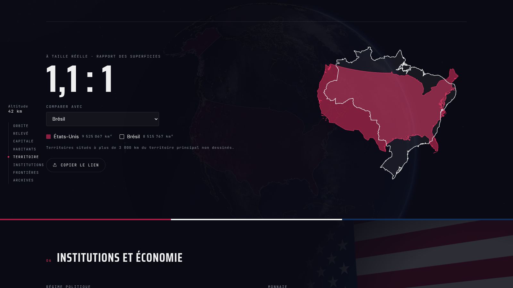
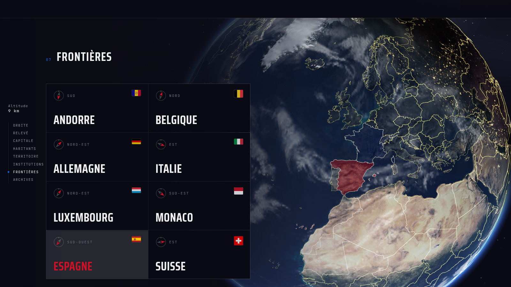
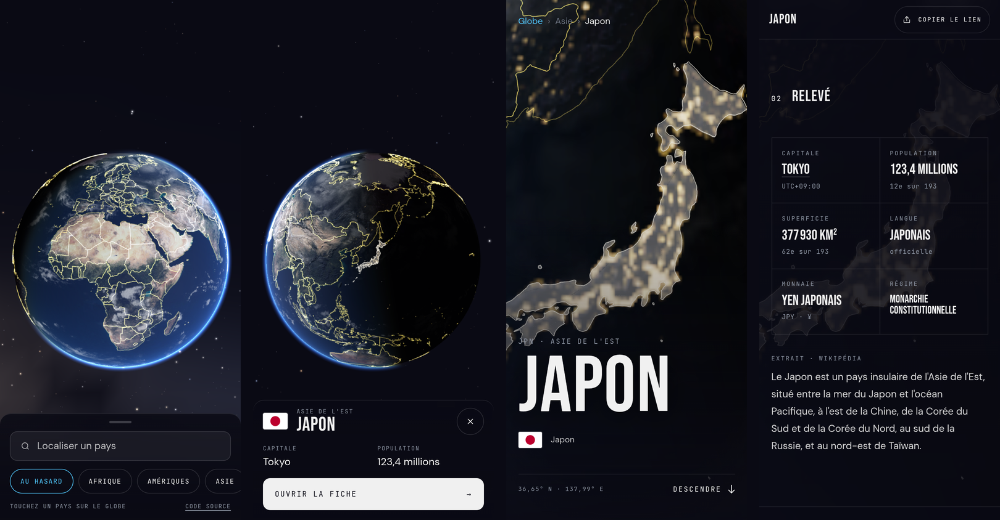

<div align="center">

# atlas

**Globe 3D interactif · les 193 États du monde**

[](https://nextjs.org)
[](https://threejs.org)
[](https://typescriptlang.org)
[](https://gsap.com)
[](./LICENSE)

**[atlas.mouwaficbdr.me](https://atlas.mouwaficbdr.me)**

</div>


---

## À propos

atlas est un explorateur mondial de pays construit autour d'un globe 3D WebGL.  
Le périmètre est celui des 193 États membres de l'ONU (filtre `unMember` de mledoze/countries, Saint-Siège exclu car simple observateur). La Terre est photoréaliste ; chaque pays révèle au survol la couleur dominante de son drapeau, extraite des pixels du drapeau et figée dans le GeoJSON. L'objectif est de prouver qu'une expérience de premier rang peut reposer entièrement sur des fondations statiques, ouvertes et sans backend propriétaire.

---

## Fonctionnalités

- **Terre photoréaliste, vrai soleil** : textures NASA Blue Marble (jour, relief, lumières des villes côté nuit), nuages, atmosphère en diffusion de Rayleigh ; le jour et la nuit affichés sont ceux de l'instant présent (point subsolaire calculé, recalé toutes les 30 s)
- **Globe interactif** : rotation et zoom libres, survol qui teinte et détoure le pays, vol de caméra vers le pays choisi ; l'accueil vise des continents éclairés à toute heure
- **Fiche pays en « descente orbitale »** : on arrive au-dessus du pays, le globe visible derrière le titre, puis relevé (six données clés), capitale (heure, jour ou nuit sur place, lever et coucher), habitants (rang sur 193, part de la population, langues), territoire, institutions et économie, frontières, archives ; rail de sommaire avec altimètre
- **Le globe accompagne la fiche** : pays mis en évidence, cadrage selon sa taille, voisin survolé allumé sur le globe
- **Climat de Köppen-Geiger** : les trois climats principaux de chaque pays et leur part du territoire (carte 1991-2020 de Beck et al.)
- **Comparateur à taille réelle** : deux pays superposés à la même échelle en projection équivalente de Lambert, sans la dilatation de Mercator ; lien partageable
- **Extrait Wikipédia** : résumé encyclopédique en français, récupéré au build avec nouvel essai et repli silencieux
- **Recherche instantanée** : depuis l'étoile de l'écran de départ ou ⌘K, insensible aux accents et aux noms français
- **Mobile** : le vrai globe, cadré pour le portrait ; tiroir à portée du pouce (recherche, pays au hasard, continents) et aperçu d'un pays au toucher
- **Arrivée « Pale Blue Dot »** : la Terre n'est qu'un point pendant le chargement réel, puis la caméra s'en approche
- **SSG pur** : 193 pages statiques pré-générées au build, aucun appel réseau au runtime pour les données pays

---

## Aperçu

<sub>Captures prises le 10 octobre 2026 à 8 h 10 UTC : l'éclairage est celui du vrai soleil à cet instant.</sub>

<table>
  <tr>
    <td colspan="2">
      
      <p align="center"><sub>Orbite : le Japon au crépuscule (17 h 10 à Tokyo), le terminateur juste dessus</sub></p>
    </td>
  </tr>
  <tr>
    <td width="50%">
      
      <p align="center"><sub>Relevé : l'essentiel d'un coup d'œil</sub></p>
    </td>
    <td width="50%">
      
      <p align="center"><sub>Capitale : heure locale et vrai ciel au-dessus d'elle</sub></p>
    </td>
  </tr>
  <tr>
    <td width="50%">
      
      <p align="center"><sub>Territoire : rang sur 193 et climats de Köppen-Geiger</sub></p>
    </td>
    <td width="50%">
      
      <p align="center"><sub>À taille réelle : le Brésil sur les États-Unis contigus</sub></p>
    </td>
  </tr>
  <tr>
    <td colspan="2">
      
      <p align="center"><sub>Frontières : survoler un voisin l'allume sur le globe</sub></p>
    </td>
  </tr>
  <tr>
    <td colspan="2">
      
      <p align="center"><sub>Mobile : le vrai globe, le tiroir, l'aperçu au toucher, la fiche</sub></p>
    </td>
  </tr>
</table>

---

## Stack technique

| Couche | Technologie | Version |
|---|---|---|
| Framework | Next.js App Router + TypeScript | 14.2 / TS 5 |
| 3D / WebGL | Three.js + react-three-fiber | 0.170 / 8.17 |
| Animation | GSAP 3 + ScrollTrigger | 3.12 |
| État global | Zustand | 5.0 |
| Smooth scroll | Lenis | 1.1 |
| Contenu éditorial | MDX + next-mdx-remote | 6.0 |
| Triangulation | earcut | 3.0 |
| Tests | Vitest + fast-check | 4.1 |

**Sources de données**

| Source | Données | Accès |
|---|---|---|
| [mledoze/countries](https://github.com/mledoze/countries) | Noms FR, gentilés, capitale, monnaies, langues, indicatif, TLD, voisins, appartenance à l'ONU | Vendoré dans `scripts/vendor/`, figé au build |
| [countries-and-timezones](https://www.npmjs.com/package/countries-and-timezones) | Fuseau IANA de la capitale (gère l'heure d'été) | Dépendance npm, utilisée à la génération |
| [Wikidata (SPARQL)](https://query.wikidata.org) | Forme de gouvernement (P122), libellé français ; coordonnées des capitales (P36, P625) | Vendoré dans `scripts/vendor/`, figé au build |
| [Banque mondiale](https://data.worldbank.org/indicator/SP.POP.TOTL) | Population (dernière année publiée, affichée sur la fiche) | Vendoré dans `scripts/vendor/`, figé au build |
| [Beck et al. 2023](https://doi.org/10.1038/s41597-023-02549-6), *Scientific Data* 10, 724 | Climats de Köppen-Geiger 1991-2020 (carte à 0,1°), trois classes principales par pays | Calculé par `scripts/compute-koppen.mjs`, vendoré dans `scripts/vendor/koppen.json` |
| [Natural Earth 1:50m](https://www.naturalearthdata.com) | Géométrie des frontières (GeoJSON) | Fichier statique, domaine public |
| [NASA Blue Marble](https://visibleearth.nasa.gov) via les exemples [three.js](https://github.com/mrdoob/three.js/tree/dev/examples/textures/planets) | Textures de la Terre (jour, nuit, relief, nuages) | `public/textures/earth/`, domaine public / MIT |
| [Wikipedia REST API](https://fr.wikipedia.org/api/rest_v1/) | Extraits encyclopédiques (cascade FR puis EN) | Récupéré au build, cache Next.js 24h, repli silencieux |
| MDX local | Articles éditoriaux par pays | `/content/countries/[cca3].mdx` |

Les données pays sont figées dans le dépôt (`public/data/countries-geo.json` + `scripts/vendor/`). Aucune base de données. Aucun backend propriétaire. Aucun appel réseau au runtime.

---

## Architecture

```
atlas/
├── app/
│   ├── layout.tsx              # RootLayout, polices, métadonnées
│   ├── page.tsx                # Page d'accueil (globe)
│   ├── opengraph-image.tsx     # Image OG générée (site et par pays)
│   ├── not-found.tsx           # 404 dans l'univers atlas
│   └── pays/[code]/            # 193 pages SSG et leur chargement
├── components/
│   ├── globe/                  # GlobeScene, EarthMesh, CloudsMesh, AtmosphereMesh,
│   │                           #   StarField, BordersMesh, HoverHighlight, CameraTransition
│   ├── country/                # CountryCard (descente orbitale), DescentRail, CapitalSky,
│   │                           #   ClimateDisplay, TrueSizeCompare, NeighborCards, CountryFooter
│   ├── ui/                     # SearchPalette, LoadingScreen, GlobeOnboarding, MobileHomeDock,
│   │                           #   MobileExplorer, OffMapScreen...
│   └── layout/                 # PersistentLayout, Navigation (étoile de recherche)
├── lib/                        # search-engine, geojson-loader, solar (soleil), koppen,
│   │                           #   true-size (projection de Lambert), bearing...
│   └── globe/                  # sélection des pays, soleil, intro caméra, textures
├── content/countries/          # Fichiers MDX éditoriaux ([cca3].mdx)
├── public/data/                # countries-geo.json (géométrie et propriétés figées)
├── public/textures/earth/      # Textures NASA de la Terre
├── scripts/                    # generate-geo.js, fetch-vendor-data.js, compute-koppen.mjs, compute-flag-colors.mjs, vendor/
└── shaders/                    # GLSL : atmosphère, nuages, ciel, étoiles
```

**Flux de données**

1. **Vendoring** (manuel, hors build) : `scripts/fetch-vendor-data.js` fige mledoze/countries, la forme de gouvernement et les capitales (Wikidata) et la population (Banque mondiale) dans `scripts/vendor/` ; `scripts/compute-koppen.mjs` y calcule les climats depuis la carte de Beck et al. et `scripts/compute-flag-colors.mjs` les couleurs des drapeaux (couleurs réellement présentes, jamais des moyennes)
2. **Génération** (manuel, hors build) : `scripts/generate-geo.js` reconstruit `public/data/countries-geo.json` : filtre aux États membres de l'ONU, noms, langues et monnaies en français, fuseaux IANA, indicatif, TLD, couleurs du drapeau, centroïde, passe géométrie
3. **Build** : `generateStaticParams` lit les 193 codes du GeoJSON et pré-génère toutes les routes ; seul l'extrait Wikipédia est récupéré en ligne (repli silencieux)
4. **Runtime SSG** : les données complètes de chaque pays sont injectées statiquement dans la page ; le client ne fait aucun appel réseau de données
5. **Client** : le GeoJSON est chargé une fois au montage du globe et mis en cache en mémoire (singleton)

---

## Installation

```bash
git clone https://github.com/mouwaficbdr/atlas.git
cd atlas
npm install
npm run dev
```

L'application tourne sur [http://localhost:3000](http://localhost:3000).

**Build de production**

```bash
npm run build
npm start
```

> **Note** : le build génère les 193 pages statiques via `generateStaticParams`. Les données pays sont figées dans le dépôt ; seul l'extrait Wikipédia est récupéré au build, avec repli silencieux si l'API est indisponible.

**Régénérer les données pays**

```bash
node scripts/fetch-vendor-data.js   # rafraîchit scripts/vendor/ (réseau)
node scripts/generate-geo.js        # reconstruit public/data/countries-geo.json (hors ligne)
```

---

## Tests

```bash
npm test           # vitest run
npm run test:watch # vitest (mode watch)
```

Les tests couvrent les fonctions critiques : moteur de recherche (fuzzy matching, insensibilité aux accents et aux noms français), sélection d'un pays sur le globe (inversion de projection, point-in-polygon), position du soleil (solstices, équinoxe, lever et coucher, jours polaires), projection équivalente du comparateur, cadrage du globe en portrait, couverture des données des 193 pays, formatage des coordonnées et vérificateur de contraste WCAG 2.1.

---

## Licence

[MIT](./LICENSE)
